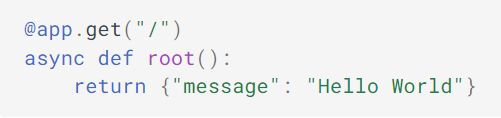

# Proyecto Individual MLOPs

## Descripción

El trabajo realizado se enmarca en le desarrollo del proyecto individual para el bootcamp soy henry, la idea es ponernos en el rol de Datascientist,
tomando como punto de partida varios conjuntos de datos o datasets relacionados con plataformas de streaming, para los cuales se establecen los siguientes objetivos:
- Proceso de ETL.
- Desarrollo de API Y Deployment.
- Análisis exploratorio de los datos.
- Sistema de recomendación.
- video con el resultado del proceso.

## Proceso de ETL

El  ETL consiste en la extracción, transformación y carga de los datos.

### E
Se tomaron los datasets en formato csv y se disponibilizaron por medio de la librería Pandas, se analiza que pasos se deben seguir para la transformación y así
lograr la limpieza de los datos.

### T
Generación de un campo **`id`** basado en el show_id ya existente, pero anteponiendo la inicial a la plataforma que pertenece:  
ej: **`s1111`**  ----  **`ns1111`** al pertenecer a Netflix. 

Los valores nulos del campo rating se reemplazan por el string **`“G”`**.  

Se hace la trasformación de la fecha pasando al formato **`AAAA-mm-dd`**  ej:  **`March 30 2021`** a **`2021-03-30`**.  

Todos los campos de texto se establecen en minúscula.  

El campo duration se convierte en dos campos:  

                duration_int que se transforma a tipo entero int32.  
                duration_type que se establece con los valores min y seasons.  

Se creo un campo **`platform`** y **`score`** para realizar las consultas posteriores.

### L
Se unifican los datos de todas las plataformas en un solo dataset para alimentar la API.

## Desarrollo de la API

La API se construye usando el framework [FastAPI](https://fastapi.tiangolo.com/).  
La idea era disponibilizar ciertas consultas sobre las películas basadas en valores como el año, la plataforma y la duración.  
Las consultas se trabajaron bajo el formato:  

 
    
El deploy se hizo por medio de la plataforma [railway](https://railway.app/) creando una cuenta de usuario y enlazando nuestro GitHub.  
Railway usa Nixpacks para compilar e implementar el código y soporta lenguajes como Python en este caso en concreto, solo hace falta un archivo JSON 
con la configuración y aquí está el enlace con la app en producción [dts-pi-mlops-production.up.railway.app](https://negflorez-dts-pi-mlops-production.up.railway.app/)  
Ahora podemos revisar las consultas cargadas en la app que son:  

Película con mayor duración con filtros opcionales de AÑO, PLATAFORMA Y TIPO DE DURACIÓN.  
    Consulta de ejemplo: [https://dts-pi-mlops-production.up.railway.app/max_duration/?year=2017&platform=amazon&duration_type=min](https://negflorez-dts-pi-mlops-production.up.railway.app/max_duration/?year=2017&platform=amazon&duration_type=min)
  
Cantidad de películas por plataforma con un puntaje mayor a XX en determinado año.  
    Consulta de ejemplo: [https://dts-pi-mlops-production.up.railway.app/score_count/?platform=netflix&score=3.5&year=2019](https://negflorez-dts-pi-mlops-production.up.railway.app/score_count/?platform=netflix&score=3.5&year=2019)

Cantidad de películas por plataforma con filtro de PLATAFORMA.  
    Consulta de ejemplo: [https://dts-pi-mlops-production.up.railway.app/count_platform/hulu](https://negflorez-dts-pi-mlops-production.up.railway.app/count_platform/hulu)

Actor que más se repite según plataforma y año.  
    Consulta de ejemplo: [https://dts-pi-mlops-production.up.railway.app/actor/?platform=disney&year=2015](https://negflorez-dts-pi-mlops-production.up.railway.app/actor/?platform=disney&year=2015)
    
Entrando en [https://dts-pi-mlops-production.up.railway.app/docs](https://negflorez-dts-pi-mlops-production.up.railway.app/docs) se puede acceder a la documentación y probar otras consultas o directamente sobre la barra de direcciones.

## video

Por ultimo se pide un video con el resultado del proceso que estará subido aquí   
